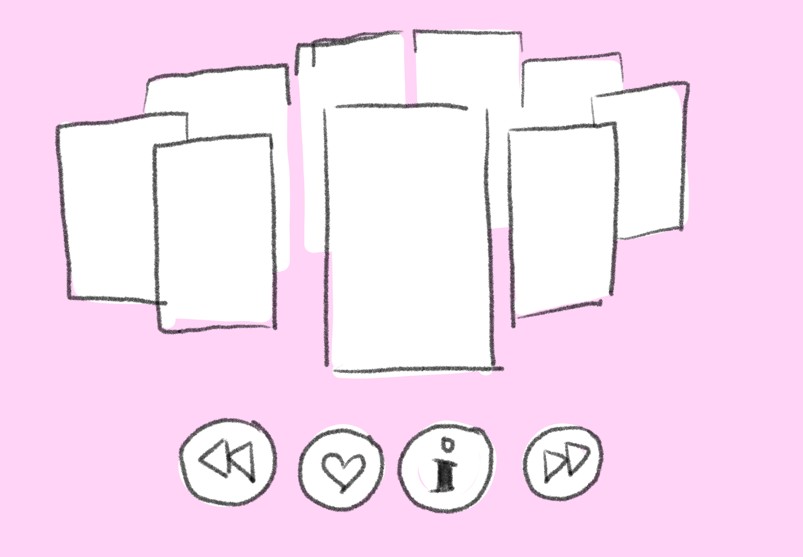
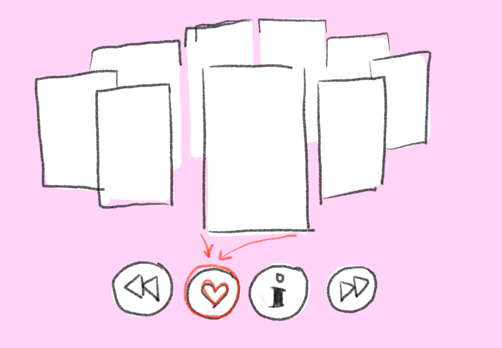
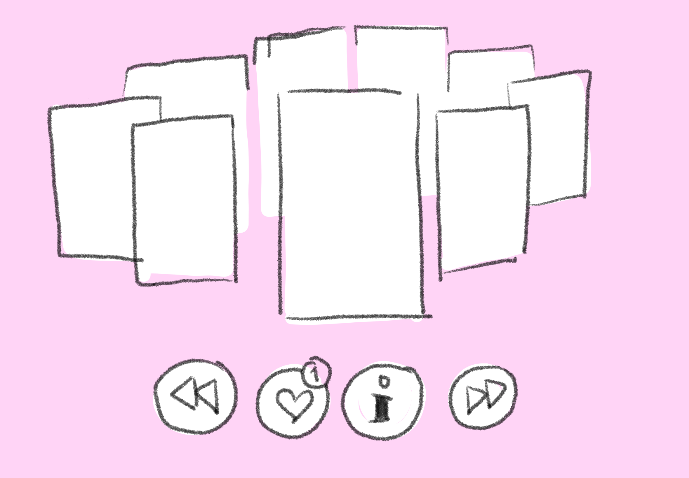
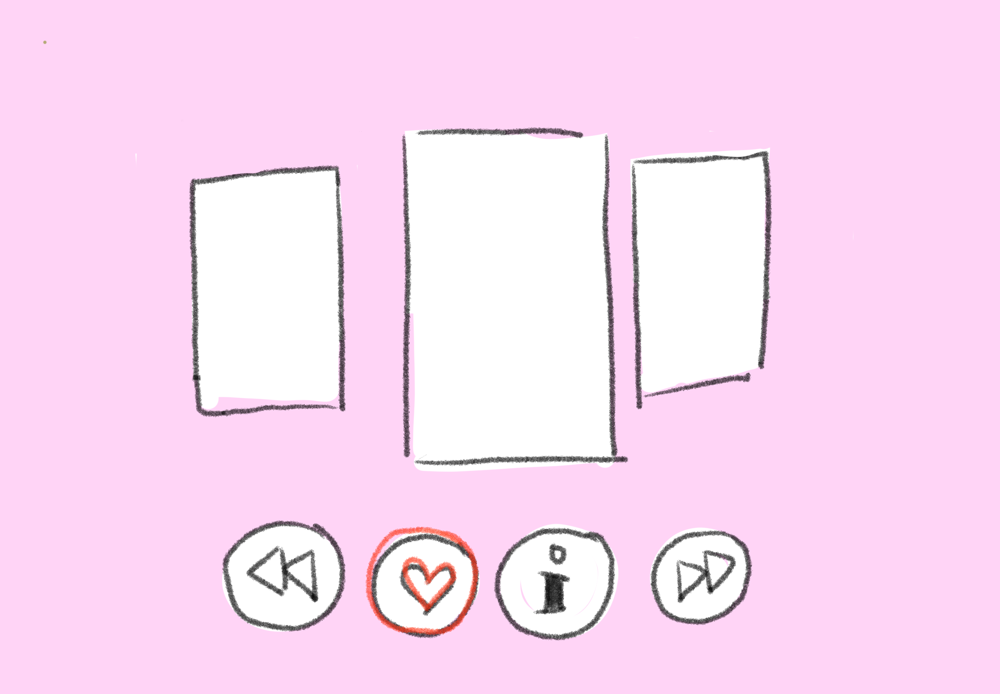
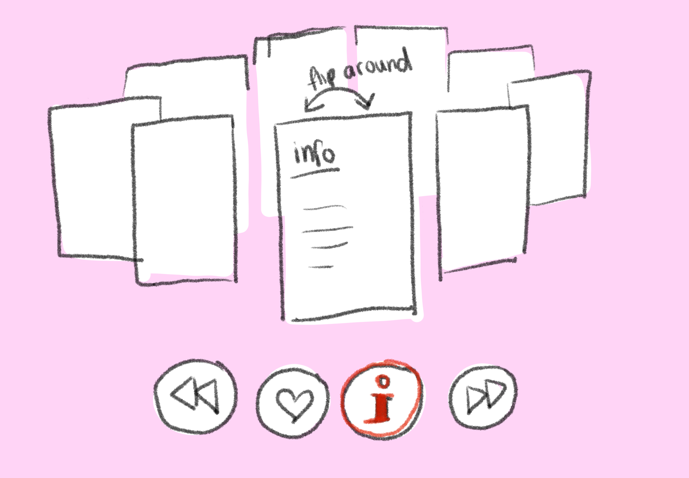
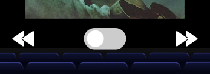
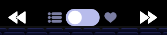

# Procesverslag
**Auteur:** Ruby Heiting

**De opdrachten:** [opdracht 1](opdracht1/index.html) en [opdracht 2](opdracht2/index.html)

Markdown is een simpele manier om HTML te schrijven.  
Markdown cheat cheet: [Hulp bij het schrijven van Markdown](https://github.com/adam-p/markdown-here/wiki/Markdown-Cheatsheet).

Nb. De standaardstructuur en de spartaanse opmaak van de README.md zijn helemaal prima. Het gaat om de inhoud van je procesverslag. Besteedt de tijd voor pracht en praal aan je website.

Nb. Door *open* toe te voegen aan een *details* element kun je deze standaard open zetten. Fijn om dat steeds voor de relevante stuk(ken) te doen.

## Bronnenlijst
  1. -bron 1-
  2. -bron 2-
  3. -...-

## Opdracht 1 plan

  Voor deze opdracht heb ik ervoor gekozen om het Amazon logo te animeren. Het lijkt mij leuk om een pakketje het scherm in te laten "sliden", vervolgens laten afremmen, omvallen en dat het logo eruit valt. Ik heb nog geen idee hoe ik dat allemaal zou moeten doen maar dat ga ik de komende maand uitzoeken. 
- Ik ga beginnen met het "pakketje" te nmaken en vorm te geven.
- Vervolgens ga ik dit animeren.
- Letters teovoegen
- 1 voor 1 animeren

  ### Je storyboard:
  
   

  ### Je ambitie: 
  Aan deze technieken/punten wil ik werken:
  - animaties maken
  - werken met keyframes
  - breakpoints toevoegen
  - leren om vormen te maken zonder het importeren van foto's
 

## Opdracht 1 reflectie

  
uitwerken bij afronden opdracht (voor week 4)

  ### Je uitkomst - karakteristiek screenshot(s):
  
  
  

  ### Dit ging goed/Heb ik geleerd: 
  - Het animeren van het pakketje vond ik nog verassend makkelijk. 
  - ik kon het font online niet vinden dus ik heb zelf de letters moeten overtrekken op mijn iPad en deze vervolgens in een fontmaker moeten zetten. Dit was de eerste keer dat ik dit gedaan heb en vond het nog verrassend makkelijk. Ik ga dit zeker in de toekomst nog een keer gebruiken als ik een bepaald font niet kan vinden of verder wil customizen. Het kost wel best wat extra tijd maar dat was het zeker waard.

 

  ### Dit was lastig/Is niet gelukt:
 - Ik ben vast gelopen met het centreren en responsive maken van de content. Hij werkt nu op iPhone en volledig desktop voormaat maar daar tussenin doet hij raar. Ik hoop dit nog te kunnen fixen voor de uiteindelijke oplevering.
 - Ook vond ik het lastig om de letters draaiend uit de doos te laten vallen. Het is uiteindelijk redelijk goed geluit maar heb heel veel dingen moeten proberen om te zo te laten werken. Omdat de doos draait moeten de letters in eerste instantie gedraaid in de doos staan. Hierdoor werkt de logica van de orientatie van de letters niet meer.

 

## Opdracht 2 plan

  
uitwerken na schetsen idee (voor week 5)

  Voor de tweede opdracht heb ik voor de volgende case geozen: "In een grote verzameling films wil ik een aantal leuke films kunnen bewaren om ze later te bekijken." Zelf hou ik heel erg van films dus het leek mij leuk om hier iets leuks van te maken. 
  Mijn plan is om een carrousel aan films te hebben hierbij kan de films liken, deze worden vervolgens bewaard en kan je laten terug vinden. Ook kan je van alle films informatie krijgen over de film. Zoals regisseur, samenvatting, jaar van uitkomst, duur van de film, acteurs, imbd rating enz. Zie hieronder een schets van mijn design:

  ### Je ontwerp:
  
  
  
  
  
  
  ### Later toegevoegd:
Toen ik begon aan het maken van de website heb ik mijn design volledig veranderd. Ik wilde het laten lijken alsof je zelf in de bioscoop zit en de films daar op het scherm voorbij ziet komen. Hierdoor zie je geen caroussel meer maar maar 1 film tegelijk. Ik wil vervolgens knoppen toevoegen om door de films heen te kunnen navigeren. (Dit wil ik gaan doen door alle films op elkaar te zetten en alleen die aan de beurt is op zichtbaar te zetten.) Bij die knoppen ga ik een toggle toevoegen waarbij je kan wisselen van alle films naar je gelikte films. De informatie en trailer wil ik met andere knoppen navigeren. Deze 'schermen' ga ik waarschijnlijk allemaal naast elkaar zetten en door de ul (het window) voorbij laten sliden.

  ### Je ambitie: 
  Aan deze technieken/punten wil ik werken:
  - Ik wil beter worden in javascript. Ik heb er nog maar één keer eerder mee gewerkt en dat was een jaar geleden. Veel hiervan weet ik niet meer zo goed. Hier ga ik dus veel tijd in stoppen om het weer op te pakken en veel nieuwe dingen te proberen.
  - Vaak vind ik het moeilijk om mijn websites goed responsive te krijgen. Dit gebeurt vaak doordat ik begin met het opbouwen zonder er goed rekening mee te houden en vervolgens is het achteraf veel moeilijker om het goed te krijgen. Hier ga ik dus vanaf het begin goed op focussen zodat dat perfect werkt en ik daarna meer aan het design kan gaan zonder daar nog zorgen over te maken.

## Opdracht 2 test

  
uitwerken na testen (week 7)

Ik heb deze test uitgevoerd met Ruud Jansen (medestudent CMD). Om de website te testen heb ik hem zelf er doorheen laten gaan en heeft hij alles wat hij dacht hardop gezegd die ik verveolgens opgescherven en uitgewerkt heb. Dit zijn de bevindingen die er gevonden waren en hoe ik ze aangepast heb:

  ### Bevinding 1:
  Doel vasn toggle (op eerste zicht) onduidelijk.

  #### oplossing:
  Bij het voor het eerst kijken naar de pagina zonder dingen uit te proberen was het nog onduidelijk waar de toggle voor bedoelt was. Aangezien er niets bijgezet was. Om dit te verbeteren heb ik twee iconen toegevoegd. Als de toggle aan de linker kant (default) staat zie je de gehele lijst aan films. Hier heb ik dus een lijst icoon voor gebruikt. Wanneer er op de toggle geklikt wordt zie je alleen je gelikte films. Hiervoor heb ik een hartje toegevoegd. Aangezien dat ook het icoontje is voor de knop om films in die lijst te zetten leek mij dit het duidelijkste icoon.

Before:

After:

  ### Bevinding 2:
  Filmlijst loopt niet.

  #### oplossing:
  Hier had ik daarvoor nog geen tijd voor gehad en was het daardoor een beetje vergeten. Je kon op dat moment wel al heen en weer gaan tussen de films maar als je bij de laatste aangekomen was kon je niet doorklikken om weer bij de eerste aan het komen. Dit beleek uiteindelijk heel makkelijk om aan te passen door een extra if in de javascript functie toe te voegen die kijkt naar wat het nummertje van de huidige film is (0 - 9). Bij de 'Next button' heb ik toegevoegd dat als de huidige film nummer 9 is en de gebruiker klikt op die knop dat hij het nummer naar 0 veranderd. Voor de 'Back button' werkt het exact het tegenovergestelde. Wanneer het film nummer 0 is en er wordt op de knop geklikt gaat hij naar 9. Zo simpel was het.
  
  Next button toevoeging code:
  

  
  Back button toevoeging code:
  

   ### Bevinding 3:
  Knoppen voor de posters en trailer onduidelijk.

  #### oplossing:
  
  
  
  
  
   ### Bevinding 4:
  Kunnen wisselen tussen alleen info/trailers van de films.

  #### oplossing:
  
  
  
  
  
   ### Bevinding 5:
  Filmlijst loopt niet.

  #### oplossing:

## Opdracht 2 reflectie

  
uitwerken bij afronden opdracht (voor week 8)

  ### Je uitkomst - karakteristiek screenshot(s):
  

  ### Dit ging goed/Heb ik geleerd: 
  Korte omschrijving met plaatje(s)

  

  ### Dit was lastig/Is niet gelukt:
  Korte omschrijving met plaatje(s)

  

