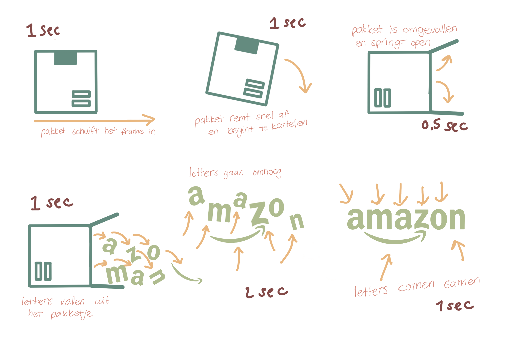
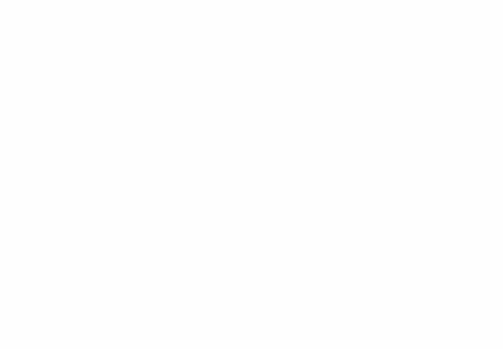
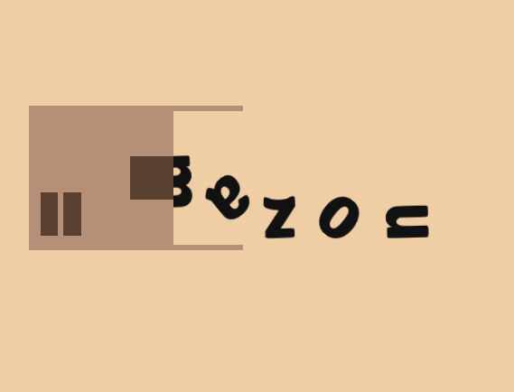
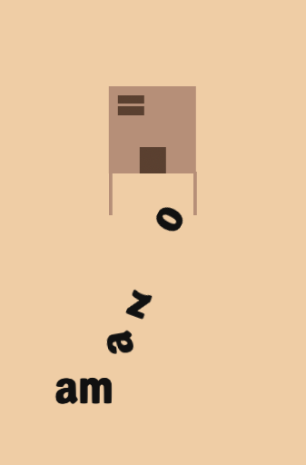
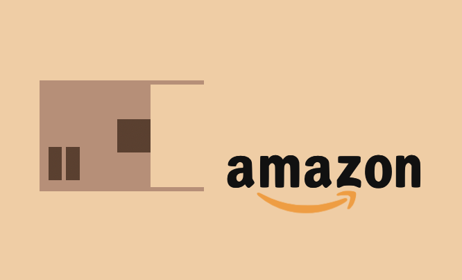

# Procesverslag
**Auteur:** Ruby Heiting

**De opdrachten:** [opdracht 1](opdracht1/index.html) en [opdracht 2](opdracht2/index.html)

Markdown is een simpele manier om HTML te schrijven.  
Markdown cheat cheet: [Hulp bij het schrijven van Markdown](https://github.com/adam-p/markdown-here/wiki/Markdown-Cheatsheet).

Nb. De standaardstructuur en de spartaanse opmaak van de README.md zijn helemaal prima. Het gaat om de inhoud van je procesverslag. Besteedt de tijd voor pracht en praal aan je website.

Nb. Door *open* toe te voegen aan een *details* element kun je deze standaard open zetten. Fijn om dat steeds voor de relevante stuk(ken) te doen.

## Bronnenlijst
  1. -bron 1-
  2. -bron 2-
  3. -...-

## Opdracht 1 plan

  Voor deze opdracht heb ik ervoor gekozen om het Amazon logo te animeren. Het lijkt mij leuk om een pakketje het scherm in te laten "sliden", vervolgens laten afremmen, omvallen en dat het logo eruit valt. Ik heb nog geen idee hoe ik dat allemaal zou moeten doen maar dat ga ik de komende maand uitzoeken. 
- Ik ga beginnen met het "pakketje" te nmaken en vorm te geven.
- Vervolgens ga ik dit animeren.
- Letters teovoegen
- 1 voor 1 animeren

  ### Je storyboard:
  
   

  ### Je ambitie: 
  Aan deze technieken/punten wil ik werken:
  - animaties maken
  - werken met keyframes
  - breakpoints toevoegen
  - leren om vormen te maken zonder het importeren van foto's
 

## Opdracht 1 reflectie

  
uitwerken bij afronden opdracht (voor week 4)

  ### Je uitkomst - karakteristiek screenshot(s):
  
  
  

  ### Dit ging goed/Heb ik geleerd: 
  - Het animeren van het pakketje vond ik nog verassend makkelijk. 
  - ik kon het font online niet vinden dus ik heb zelf de letters moeten overtrekken op mijn iPad en deze vervolgens in een fontmaker moeten zetten. Dit was de eerste keer dat ik dit gedaan heb en vond het nog verrassend makkelijk. Ik ga dit zeker in de toekomst nog een keer gebruiken als ik een bepaald font niet kan vinden of verder wil customizen. Het kost wel best wat extra tijd maar dat was het zeker waard.

 

  ### Dit was lastig/Is niet gelukt:
 - Ik ben vast gelopen met het centreren en responsive maken van de content. Hij werkt nu op iPhone en volledig desktop voormaat maar daar tussenin doet hij raar. Ik hoop dit nog te kunnen fixen voor de uiteindelijke oplevering.
 - Ook vond ik het lastig om de letters draaiend uit de doos te laten vallen. Het is uiteindelijk redelijk goed geluit maar heb heel veel dingen moeten proberen om te zo te laten werken. Omdat de doos draait moeten de letters in eerste instantie gedraaid in de doos staan. Hierdoor werkt de logica van de orientatie van de letters niet meer.

 

## Opdracht 2 plan

  
uitwerken na schetsen idee (voor week 5)

  ### Je ontwerp:
  

  ### Je ambitie: 
  Aan deze technieken/punten wil ik werken:
  - punt 1
  - punt 2
  - nog een punt
  - ...

## Opdracht 2 test

  
uitwerken na testen (week 7)

  Neem minimaal 5 bevindingen op:

  ### Bevinding 1:
  Omschrijving van wat er nog niet orde was (tekst en afbeeding(en)).

  #### oplossing:
  Beschrijving hoe je het hebt hebt opgelost of als het niet gelukt is hoe je het zou oplossen (tekst en afbeeding(en)).

  ### Bevinding 2:
  Omschrijving van wat er nog niet orde was (tekst en afbeeding(en)).

  #### oplossing:
  Beschrijving hoe je het hebt hebt opgelost of als het niet gelukt is hoe je het zou oplossen (tekst en afbeeding(en)).

  ### Bevinding 3:
  ...

## Opdracht 2 reflectie

  
uitwerken bij afronden opdracht (voor week 8)

  ### Je uitkomst - karakteristiek screenshot(s):
  

  ### Dit ging goed/Heb ik geleerd: 
  Korte omschrijving met plaatje(s)

  

  ### Dit was lastig/Is niet gelukt:
  Korte omschrijving met plaatje(s)

  

